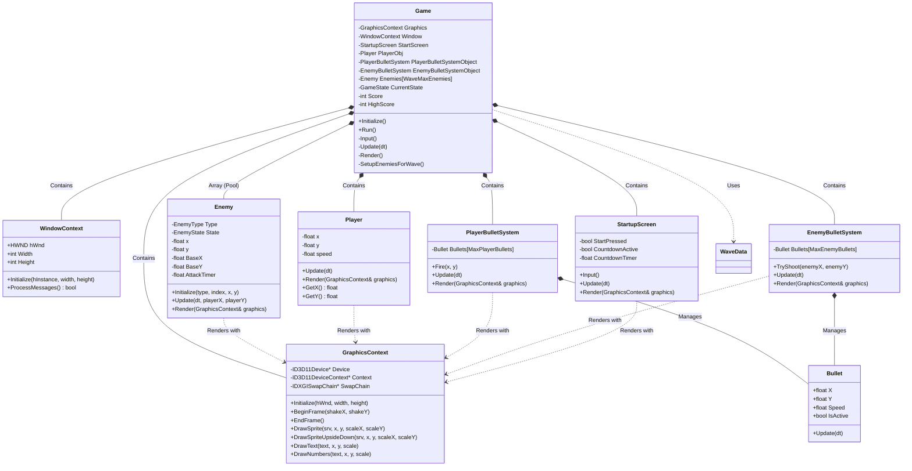

# Galaga 프로젝트 클래스 다이어그램 (Class Diagram)

프로젝트의 전체적인 구조와 클래스 간의 관계(의존성 및 포함 관계)를 한눈에 파악할 수 있도록 작성된 클래스 다이어그램입니다.

### 💡 주요 관계 설명 (Relationships)
1.  **Composition (포함 관계, `*--`)**: 
    *   `Game` 클래스는 프로젝트의 메인 컨트롤러로, 그래픽(`GraphicsContext`), 윈도우(`WindowContext`), 플레이어(`Player`), 적(`Enemy`), 총알 시스템(`BulletSystem`), 시작 화면(`StartupScreen`) 객체들을 멤버 변수로 소유하며 전체 생명주기를 관리합니다.
    *   `PlayerBulletSystem`과 `EnemyBulletSystem`은 각각 자신이 발사한 `Bullet` 객체 배열을 내부적으로 관리(오브젝트 풀링 방식)합니다.
2.  **Dependency (의존 관계, `..>`)**:
    *   모든 게임 내 오브젝트(`Player`, `Enemy`, `StartupScreen`, `BulletSystem`)는 화면에 자신을 그리기 위해 `Game` 클래스가 전달해주는 `GraphicsContext`의 렌더링 함수(`DrawSprite`, `DrawText` 등)에 의존합니다.
    *   `Game` 클래스는 웨이브 전환 시 `WaveData`의 정적 데이터를 불러와 적들을 배치합니다.
