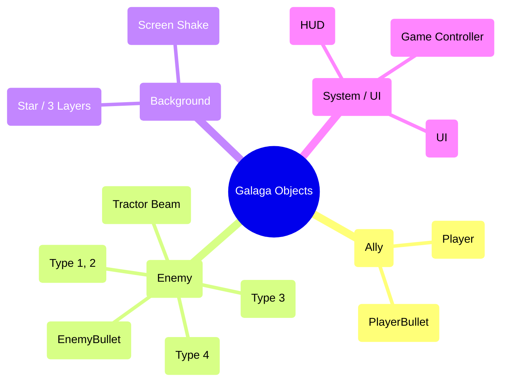

# Galaga 오브젝트 맵 (Object & Component Map)

게임 내에 존재하는 모든 오브젝트를 **아군, 적, 배경, 기타(시스템/UI)** 4가지 카테고리로 분류하고, 각 오브젝트가 내부적으로 소유하고 있는 구성 요소(속성 및 기능 컴포넌트)를 정리한 오브젝트 맵입니다.

## 🧠 오브젝트 마인드맵 (Visual Map)

---

## 1. 아군 (Ally)

| 오브젝트 (Object) | 보유 컴포넌트 (Components / Properties) | 역할 및 설명 |
| :--- | :--- | :--- |
| **Player** (플레이어 기체) | - **Transform:** 위치 좌표 (X, Y)   - **Stats:** 이동 속도, 점수(Score), 남은 생명(Lives)   - **State:** 무적 타이머(InvincibleTimer), 피격 판정(Hitbox), 납치 상태 플래그   - **Render:** `ShipTexture` 스프라이트 | 키보드 입력을 받아 움직이며, 생존과 공격을 담당하는 핵심 조작 객체입니다. 사망 시 무적 시간을 가집니다. |
| **PlayerBullet** (플레이어 총알) | - **Transform:** 위치 좌표 (X, Y)   - **Physics:** 수직 이동 속도(Velocity Y)   - **State:** 활성화 여부(Active)   - **Render:** 연두색 Quad 도형 | 플레이어가 발사하는 투사체로, 화면 밖으로 나가거나 적과 충돌하면 비활성화(오브젝트 풀링) 처리됩니다. |

---

## 2. 적 (Enemy)

| 오브젝트 (Object) | 보유 컴포넌트 (Components / Properties) | 역할 및 설명 |
| :--- | :--- | :--- |
| **Enemy** (적 기체) | - **Identifier:** 기체 타입 (Type 1, 2, 3)   - **Transform:** 현재 위치(X,Y), 편대 복귀 위치(BaseX, BaseY)   - **AI State:** 상태 머신(Idle, Diving, Looping, Beaming, Capturing, Returning)   - **Kinematics:** 베지에 곡선 연산, 루프 반경(Radius), 공격 타이머   - **Render:** 타입별 `EnemyTexture` | 상태 머신에 따라 대기, 강하, 루프, 복귀 등 복잡한 궤적으로 움직이는 적 객체입니다. |
| **EnemyBullet** (적 총알) | - **Transform:** 위치 좌표 (X, Y)   - **Physics:** 수직 하강 속도(Speed)   - **State:** 활성화 여부(Active)   - **Render:** 붉은색 Quad 도형 | 적 기체가 비행 도중 자신의 위치에서 아래로(수직) 발사하는 투사체입니다. |
| **Tractor Beam** (트랙터 빔) | - **Transform:** 발사 원점(Type 3의 하단), 도달 Y축 길이   - **Collider:** 빔 너비 및 길이에 따른 정밀 AABB 히트박스   - **Render:** 다중 역삼각형 기반 렌더링 | Type 3(보스)가 발사하는 특수 공격으로, 피격 시 플레이어를 납치하는 핵심 기믹 오브젝트입니다. |
| **Bonus Enemy** (별 기체) | - **Transform:** 위치 좌표 (X, Y)   - **Physics:** 수평 고정 이동 속도   - **Render:** `BonusStarTexture` 스프라이트 | 5웨이브마다 등장하며, 처치 시 잔기 상황에 따라 **생명 1 회복 또는 1000점(50% 확률)**, 잔기 3개일 경우 **무조건 1000점**을 주는 특별 보너스 객체입니다. |

---

## 3. 배경 (Background / Environment)

| 오브젝트 (Object) | 보유 컴포넌트 (Components / Properties) | 역할 및 설명 |
| :--- | :--- | :--- |
| **Star** (우주 별) | - **Transform:** 위치 좌표 (X, Y)   - **Properties:** 레이어 심도 (Depth: 근경/중경/원경), 하강 속도   - **VFX:** 반짝임 타이머(Blink), 픽셀 밝기 조절 색상   - **Render:** 단일 픽셀(Point) 렌더러 | 3D 공간감을 주기 위해 속도와 밝기가 다른 3개의 레이어로 나뉘어 무한 스크롤되는 배경 요소입니다. |
| **Screen Shake** (엔딩 진동) | - **Logic:** 진동 지속 타이머(EndingTimer)   - **VFX:** 뷰포트 오프셋 (Viewport TopLeft X, Y), 난수 발생기 | 30웨이브 클리어 시 뷰포트를 무작위로 뒤흔들어 강렬한 타격감을 주는 런타임 배경 효과입니다. |

---

## 4. 기타 (Others / System / UI)

| 오브젝트 (Object) | 보유 컴포넌트 (Components / Properties) | 역할 및 설명 |
| :--- | :--- | :--- |
| **Game Controller** | - **State:** 현재 상태(Startup, Playing, Paused, Ending 등)   - **Logic:** 웨이브 카운트, 적 스폰 관리, 창 포커스 감지(비활성화) 로직 | 게임의 전체 흐름 제어, 웨이브 스케일링 진행, 윈도우 비활성화 시 일시정지 로직을 관장합니다. |
| **HUD (Score / Lives)** | - **Data:** 현재 플레이어 점수(Score), 최고 점수(HighScore), 남은 생명(잔기) 수   - **Render:** `numbers.png`를 이용한 6자리 숫자 매핑 렌더러, `ship.png`를 이용한 슬롯형 고정 렌더러 | 플레이어의 현재 상태를 실시간으로 화면 우측 상단/중단에 표시하는 UI 컴포넌트입니다. |
| **Start / Ending UI** | - **Logic:** 카운트다운 타이머, 입력 대기 처리 이벤트   - **Render:** 삼각함수(sinf)를 활용한 텍스트 부유(Floating) 애니메이션, 게임 오버/엔딩 시 최종 및 최고 점수 렌더러 | 게임의 시작 화면과 게임 오버/엔딩 시 렌더링되는 동적 텍스트 애니메이션 및 점수 출력 객체입니다. |
